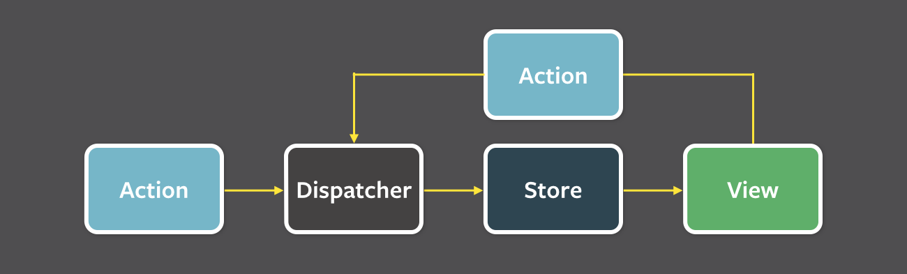

# Flux architecture
Flux is an architecture pattern with one way communication. It is linear architecture.

## Main parts of Flux
* Store - responsible for storing information 
* Dispatcher - responsible for receiving actions and sending them to the appropriate Store
* Action - responsible for sending data to Dispatcher 
* View - source of action

