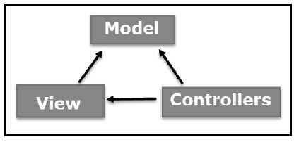

# MVC architecture
is an architectural pattern that separates an application into three main logical components: the model, the view, and the controller.

## Main parts of MVC
* Model - The central component of the pattern. It is the application's dynamic data structure, independent of the user interface. It directly manages the data, logic and rules of the application.
* View - Any representation of information such as a chart, diagram or table. Multiple views of the same information are possible, such as a bar chart for management and a tabular view for accountants.
* Controler - Accepts input and converts it to commands for the model or view.

